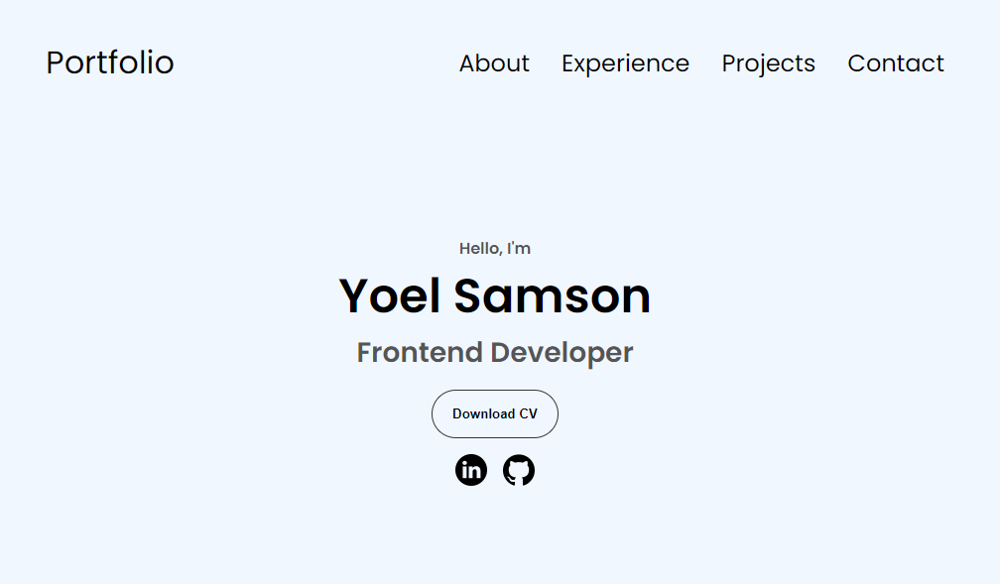

# Title

- Hi 👋, I'm Yoel Samson



- My own GitHub profile README.md

# Subtitle

Frontend Developer Student Showcase of my first year work, before beginning my second year.

# Description

Hi Welcome i am an Frontend Developer Student from Noroff online school. in this Portfolio i am showcaseing my project for the first year i have been working on and learning. The projects honing my skills and showcasing how far i have come and for testament to the dedication and creativety i have though out the year as i explore the fascinating world of web development.

# Portfolio

1. Clone the repo:

```bash
git clone https://github.com/YoelSam1/Yoel-Portfolio1.git
```

2. Live demo Link:

```bash
https://splendid-daifuku-a10248.netlify.app/
```

# My project

Cross-Course Project an e-commerce website - Build Using HTML AND CSS

- Github (https://github.com/Noroff-FEU-Assignments/cross-course-project-YoelSam1)
- Live demo (https://calm-tanuki-e4dc43.netlify.app/)

Semester Project 1 an Museum website - Build Using HTML AND CSS

- Github (https://github.com/YoelSam1/yoel-semester-project-1)
- Live demo (https://zesty-chebakia-194e8e.netlify.app/)

Project Exam 1 an Flying Tips that are blog website - Build Using HTML AND CSS and Javascript

- Github (https://github.com/Noroff-FEU-Assignments/project-exam-1-YoelSam1)
- Live demo (https://velvety-sprite-01086c.netlify.app/)

# Skills

Programming Languages

- HTML
- CSS
- jAVASCRIPT

Software

- Figma ( to Create a prototype in all sreen size)

Other

- Github
- Netlify (to deploy the site on live demo)

# Contact

- Email ( Yoelsamson21@gmail.com)
